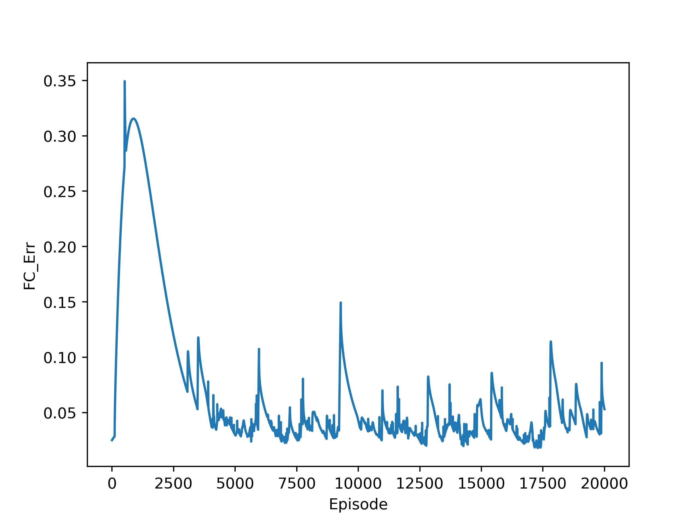

# TwoCapital
Repo for R&amp;D model

## Prerequisite

- PETSc installed with flag `--with-petsc4py --with-debugging=no PETSC_ARCH=arch-xx-opt`
- Maintain PETSc, `export PETSC_ARCH=arch-xx-opt`, 
    `export PETSC_DIR=<your petsc file>`
    `export PYTHONPATH=$PETSC_DIR/arch-xx-opt/lib`
- `pip install -r requirements.txt`
- To use C implementation `pip install ./src/linearsystemcore`

Errors

